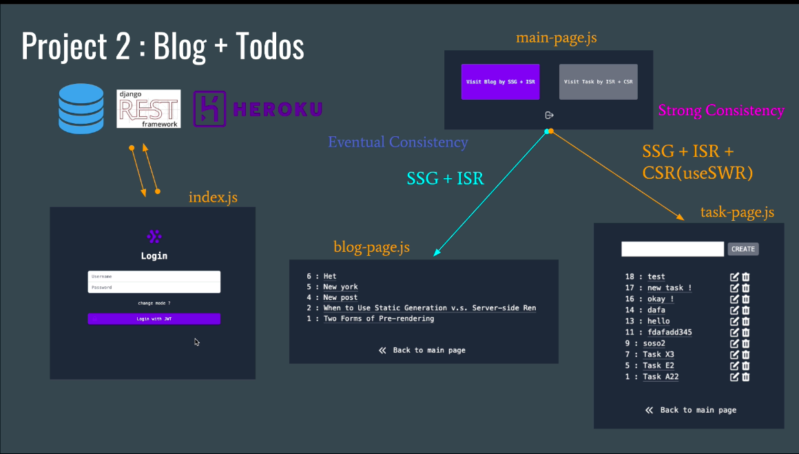
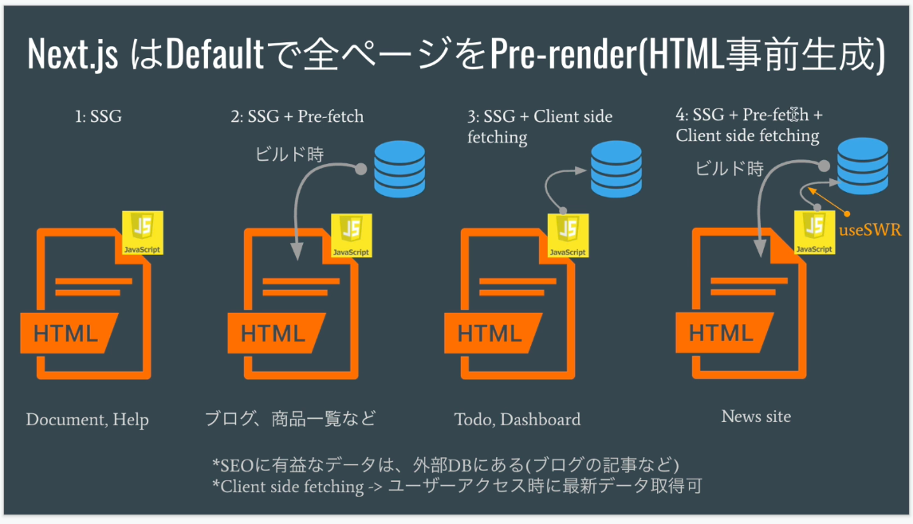

### セクション4: Nextjs Project 2 (Blog + Todos編)

#### 全体構成


#### 1. create-next-app
##### 1-1 nextjs 構築
```sh
npx create-next-app . --use-npm
```

- npxコマンド  
  - 必要なpackage.jsonを自動で作ってくれる

- create-next-appコマンド
  - nextjsのプロジェクトを作成
  - --use-npmパラメータ
    - npmを使用することを明示的に設定
  - --typescriptパラメータ
    - typescriptを利用する

##### 1-2 tailwindcss 構築

[参考URL：Install Tailwind CSS with Next.js](https://tailwindcss.com/docs/guides/nextjs)

~~~sh
$ npm install -D tailwindcss@latest postcss@latest autoprefixer@latest
~~~

-  configuration filesの作成
    ```sh
    $ npx tailwindcss init -p
    ```
- Configure Tailwind to remove unused styles in production
  ~~~diff JavaScript
  // tailwind.config.js
  module.exports = {
  - purge: [],
  + purge: ['./pages/**/*.{js,ts,jsx,tsx}', './components/**/*.{js,ts,jsx,tsx}'],
    darkMode: false, // or 'media' or 'class'
    theme: {
      extend: {},
    },
    variants: {
      extend: {},
    },
    plugins: [],
  }
  ~~~

- Import Tailwind directly in your JS
  ~~~diff JavaScript
    // pages/_app.js
     import '../styles/globals.css'
  +   import 'tailwindcss/tailwind.css'

    function MyApp({ Component, pageProps }) {
        return <Component {...pageProps} />
    }

    export default MyApp
  ~~~
  または
  ~~~diff CSS
  /* ./styles/globals.css */
  + @tailwind base;
  + @tailwind components;
  + @tailwind utilities;
  ~~~

  ##### 1-3 nextjs 起動

  ~~~sh
  $ npm run dev
  ~~~

  - 下記のURLで見れる
  ~~~HTML
  http://localhost:3000
  ~~~

  ##### 1-4 基本構築

  - Layout作成
    - componets/Layout.js

  - Auth（ログイン）コンポーネントの作成（事前準備）
    - componets/Auth.js

#### 2.Auth component UI
##### 認証コンポーネントのUI部分の作成
- 参照URL:tailwindのサンプル
[Sign-in and Registration](https://tailwindui.com/components/application-ui/forms/sign-in-forms)

- 必要モジュールのinstall

~~~sh
$ npm i @tailwindcss/forms
~~~

#### 3.Auth component (Function)
##### 認証コンポーネントに機能を追加

- 環境変数の追加
  - endpointの設定
  - ファイル名：.env.local
    - NEXT_PUBLIC_RESTAPI_URL=https://nextjs-api-tk.herokuapp.com/

- cokieモジュールのインストール
  ~~~sh
  $ npm i universal-cookie
  ~~~

- swrのインストール
  - データ取得のための React Hooks ライブラリ
  ~~~sh
  $ npm i swr
  ~~~

#### 4.Main page
- MainPageにリンク作成
- blogとtaskのページの雛形作成

#### 5.getStaticProps (Blog REST API)
#####  掲示板一覧を静的に作成
- project1の時の様子
  - 外部APIにより一覧を作成
  
- project2では作成したdjangoのAPIを利用

#### 6.Incremental Static Regeneration (ISR)
##### 掲示板の詳細ページの作成
- getStaticPathsにてfallback=trueにする
  - 範囲を超えたIDは都度取得してくれる
- revalidate: 3
  - DBが更新された場合、最初のリクエストが前の状態だが、次のリクエストで更新される
  - 3は一度更新すると、３秒間は更新されない


#### 7.useSWR + ISR + SSG
